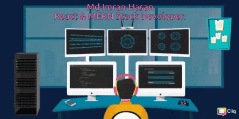

<!-- 🌟 Profile Banner -->

  

  

<h1 align="center">
  
</h1>

---

## 🧑‍💻 About Me

Assalamu Alaikum! I’m **Md Imran Hasan**, a passionate **MERN Stack Developer**.  
I have worked on real-world projects like **HireNest** and **ProFast**, where I built modern, responsive web applications.  
I'm highly enthusiastic about **technology**, always eager to learn new tools and stay updated with the latest trends in web development.

- 🔭 I’m currently working on: `HireNest` & `Diverse Dish`  
- 🌱 Learning: `Next.js`, `React Query`, `Firebase`, and `JWT Auth`
- 🤝 Open to: Frontend/Full-stack developer roles  
- 📬 Email: **programmarimran@gmail.com**  
- 🌍 Location: Dhaka, Bangladesh  
- 🎓 Student at: [Programming Hero](https://web.programming-hero.com)

---
## 🚀 Skills & Technologies

  

  
  
  
  
  

  
  
  
  

  
  
  
  
  

---

## 🤝 Connect with Me

  
  
  

---

## 📊 GitHub Stats

  
   
  

---

> ⚡ “Code. Learn. Build. Share.” — *Md Imran Hasan*
